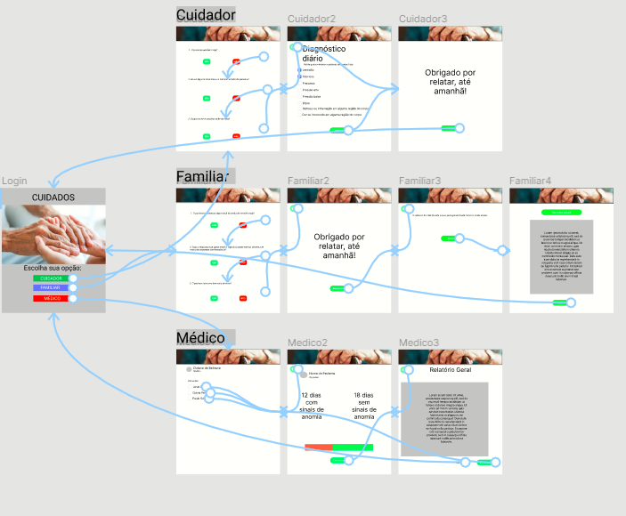

# Trabalho Final de Sistemas de Informação 2021-2

> Profª Fernanda Lima

#### Grupo 09:

- Douglas Samuel Thomazi (180119109);
- Guilherme Araújo de Oliveira (190125748);
- Lucas Vinicius Magalhaes Pinheiros (170061001);
- Maria Julia Dias Lima (170151140);
- Moisés Felipe de Lima (190018364);

## Visão Geral

- Lembrar de citar o periodico em que nos baseamos.

## Objetivos

- Lembrar de citar o periodico em que nos baseamos.

## Tecnologias Utilizadas

- Front-end:

  - HTML;
  - CSS;

- Back-end:
  - JavaScript
    - Framework X;

## Fluxograma

## Instruções de Uso
